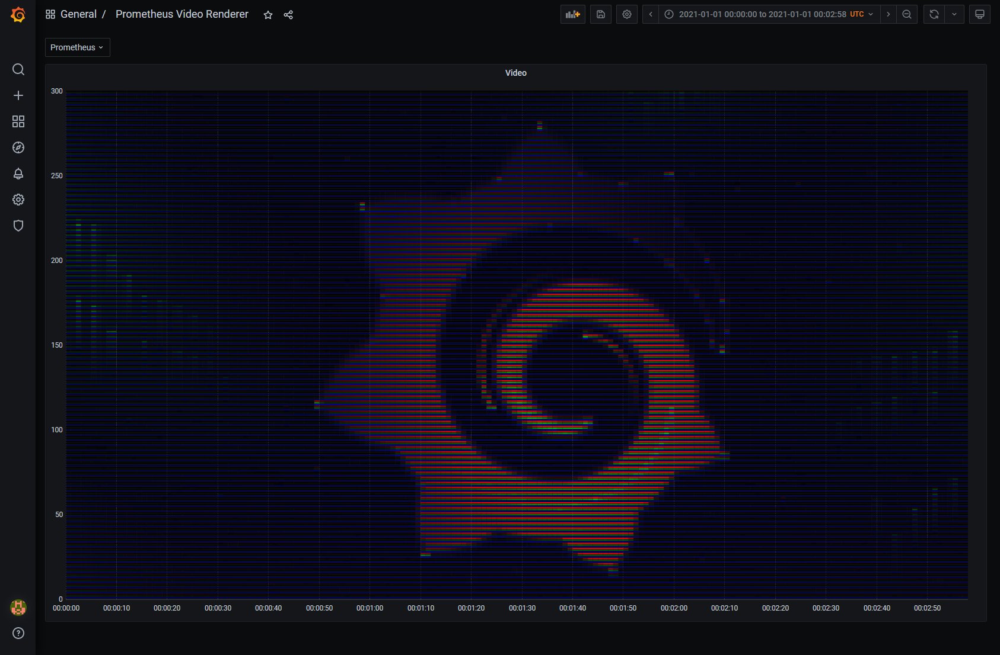

# prometheus_video_renderer

Plays videos using [Prometheus](https://prometheus.io/) and [Grafana](https://grafana.com/), e.g. [Bad Apple](https://www.youtube.com/watch?v=ApJxFprSTqA).

## Modes

Currently 3 different modes are supported.

### Bitmap

The bitmap mode either creates a sample or does not, depending on the brightness of the source image. It is the only mode compatible with the Prometheus UI.

Example: https://www.youtube.com/watch?v=ApJxFprSTqA

### Grayscale

The RGB mode creates a metric and sets a brightness label matching an override for each unique brightness.

This is made with 256 unique overrides.

Example coming soon.

### RGB

The RGB mode creates offset metrics for red, green, and blue, and sets a brightness label matching an override for each unique color/brightness.

This is 22-bit color, made with 640 unique overrides.

Example: https://www.youtube.com/watch?v=aLvh0oId3Go

## Audio

You can store and stream WAVs using prometheus_jukebox.

Example: https://www.youtube.com/watch?v=psk20qGVF10

## Inspiration

A while back I thought [this blog post](https://giedrius.blog/2019/09/21/is-it-a-good-idea-to-use-prometheus-for-storing-ascii-paintings/) and the corresponding [source code](https://github.com/GiedriusS/prometheuspainter) were kind of fun. After seeing some of [kevinjycui](https://github.com/kevinjycui/bad-apple)'s bad apple videos I thought combining these two ideas could be an interesting (and hilariously terrible) idea.

## How to use

- Download a video e.g. `bad_apple.mkv`
- Figure out the output resolution, you should scale 1:1 with height being the number of time series you want.
- Get a png sequence `ffmpeg -i bad_apple.mkv -vf "scale=180:135" -vsync 0 frames\out%06d.png`
- If you would like to make sure that the y axis doesn't change, you can add 1px white bars to each frame. e.g.
  - `ffmpeg -i frames\out%06d.png -vf "crop=in_w:in_h-1:0:1,pad=iw+0:ih+1:0:1:#FFFFFF@1,format=rgb24" -y frames\out%06d.png`
  - `ffmpeg -i frames\out%06d.png -vf "crop=in_w:in_h-1:0:-1,pad=iw+0:ih+1:0:-1:#FFFFFF@1,format=rgb24" -y frames\out%06d.png`
- `go run main.go --project="bad_apple"` (use `--help` to see all arguments)
- Loop over the files and send them to `promtool tsdb create-blocks-from openmetrics`
- `docker compose up`
- Wait for Prometheus to compact etc. so it doesn't take 20 years to render.
- Run a script to record all the frames from the UI. (Mediocre examples are in the scripts directory.)
- `cd` to wherever you stored your screenshots.
- Generate the video file `ffmpeg -framerate 30 -i '%06d.png' -c:v libx264 -pix_fmt yuv420p out.mp4`
